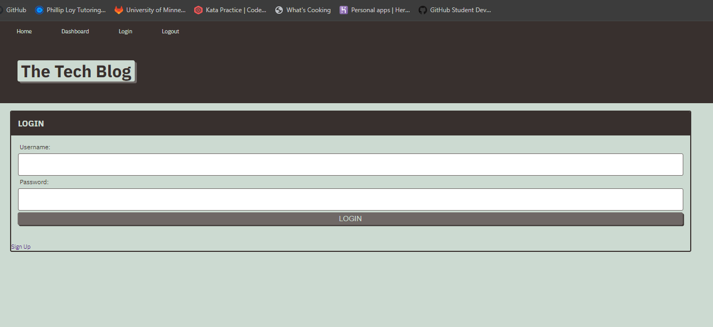

# Tech Blog
  ## Badges
  

  ## Table of Contents
  * [License](#license)
  * [Description](#description)
  * [Installation](#installation)
  * [Usage](#usage)
  * [How to Contribute](#how-to-contribute)
  * [Questions?](#questions)

  ## License
  Read more about MIT here:
  [MIT](https://opensource.org/licenses/MIT)

  ## Description
  This application allows a user to login, signup and authenticates the user. Once logged in, you are able to create, view and delete blog posts. You are also able to comment on certain blog posts and are able to delete certain comments!

  ## Installation
  You can fork this repository and download the files to your own computer.

  ## Usage
  
  https://cam-techblog-fdb82f2f2e68.herokuapp.com/
  

  ## How to Contribute
  [Contributor Covenant](https://www.contributor-covenant.org/)  
  

  ## Questions?
  ### Reach me here: 
  [cbursch13](https://github.com/cbursch13)  
  cammichbursc@gmail.com